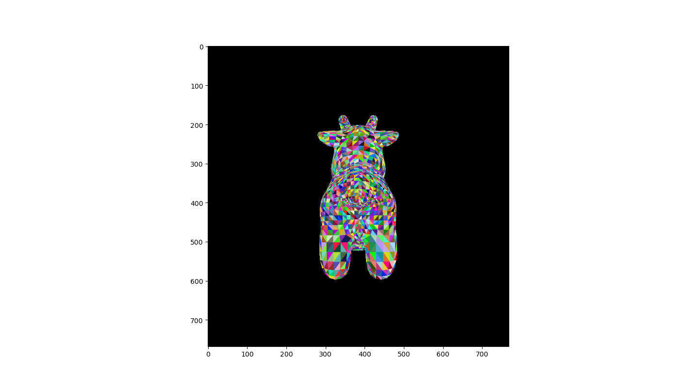
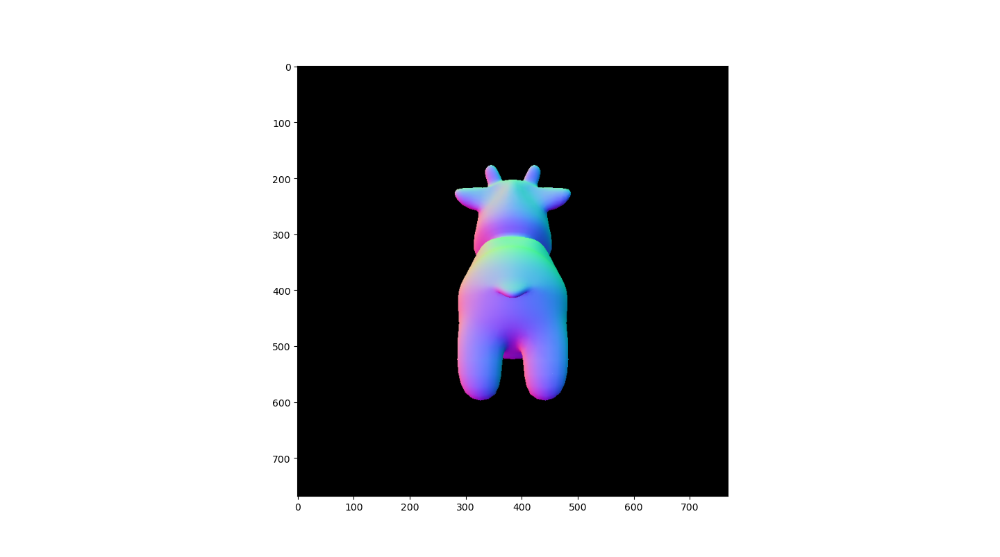
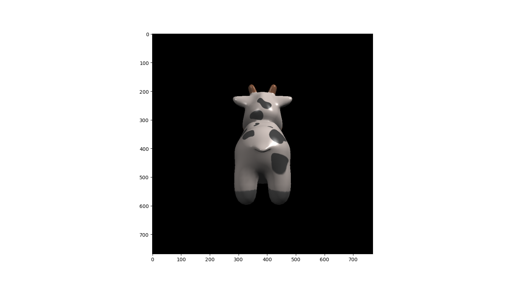
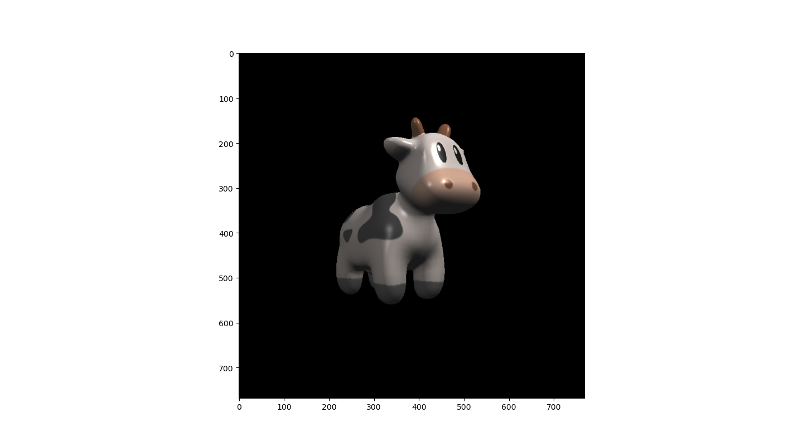

## `Python`-implemented Assignments of <br/>the Hot Course🔥*Games101*🔥

#### 1. Assignment 1    


#### 2. Assignment 2


#### 3. Assignment 3

:one: 检查 `ObjLoader`，但后来发现 `python` 有直接的库可以用😄，不需要去写那么繁杂的 `.obj` 文件解析器，即

```python
## TOINSTALL
#   pip install objloader

## TOUSEIT
from objloader import Obj
obj = Obj.open(obj_pth).to_array() # 其格式已经是逐个△了

for i in range(0, len(obj), 3):    # 遍历每个△
    for v in obj[i:i+3]:           # 遍历每个结点
        x, y, z, nx, ny, nz, u, v, _ = v
        # xyz -> 结点的世界坐标
        # nx-ny-nz -> 法向量
        # uv -> 纹理坐标
        
        # 用 VM 矩阵对 xyz 作模型变换
        # 用 [(VM)^(-1)]^T 对 nx-ny-nz 作模型变换
        # TODO
```

用随机的颜色填充每个三角形基本单元，得到：



在 `python` 中，切记对除数要加 `epsilon (e.g., 1e-8)`，不然容易出事。

| 使用法向量的分量代替 `R/G/B` 着色 | 使用纹理图着色<br/>外加：环境光+漫反射+高光 |
| --------------------------------- | ------------------------------------------- |
|       |                 |
| **Phong**                         | **Bump**                                    |
|                                   |                                             |
| **Displacement**                  | **好一点的视图凑个数**                      |
|                                   |             |

